# Classification of MSMS spectra as Prenylated Flavonoids (relevant) or not (other)

Note: Make sure that your PC has enough main memory (tested with at least 16GB) and approximately 20GB of free disk space available. 

1. Make sure that a copy of the AnnoMe repository has been downloaded. Please refer to the [README](https://github.com/chrboku/AnnoMe/blob/main/README.md) of AnnoMe for Instructions. 

2. Start a command propmpt and navigate to the AnnoMe directory.

<br><br>

## Download public MSMS repositories

3. Verify that all public MSMS repositories have been downloaded or download them. The following command will check and download missing resources automatically: 
Note: Make sure to check that you are not on a metered connection. The total size of all files to be downloaded is approximately 11GB, so this step might take some time depending on the available internet connection. On a connection with an average download speed of 1 to 2 MBit/sec this can take up to 2 hours. The progress of the download is shown. Interrupting a download will cancel the particular file, but already downloaded files will be skipped. 
```{bash}
uv run annome_downloadresources
```

<br><br>

## Filter MSMS spectra for Prenylated Flavonoids

4. Start the substructure filtering GUI with the command
```{bash}
uv run annome_filtergui
```
This will open the window for filtering MGF files by the presence or absence of specific substructures. 

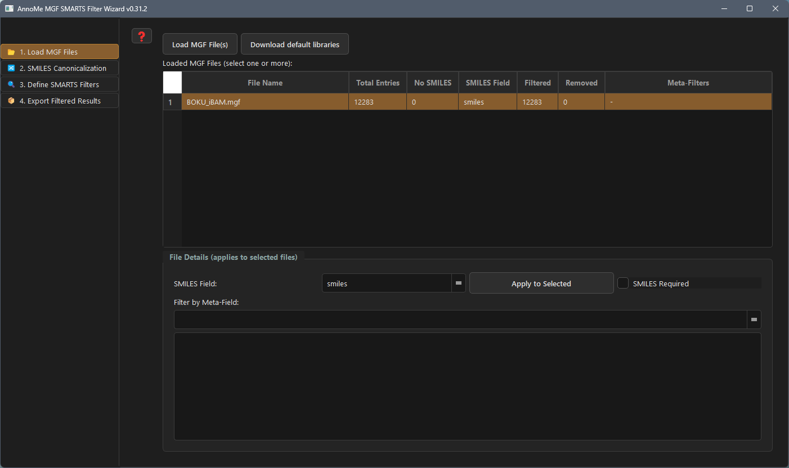

5. Click the `Load MGF File(s)` button in the first step of the GUI. Then select and load the following 19 files (all from MSnLib and one from BOKU) from the folder `resources/libraries`:
Note: Loading the files might take a couple of minutes (approximately 10 minutes on a standard laptop).
- 20241003_enamdisc_neg_ms2.mgf
- 20241003_enamdisc_pos_ms2.mgf
- 20241003_enammol_neg_ms2.mgf
- 20241003_enammol_pos_ms2.mgf
- 20241003_mcebio_neg_ms2.mgf
- 20241003_mcebio_pos_ms2.mgf
- 20241003_mcedrug_neg_ms2.mgf
- 20241003_mcedrug_pos_ms2.mgf
- 20241003_mcescaf_neg_ms2.mgf
- 20241003_mcescaf_pos_ms2.mgf
- 20241003_nihnp_neg_ms2.mgf
- 20241003_nihnp_pos_ms2.mgf
- 20241003_otavapep_neg_ms2.mgf
- 20241003_otavapep_pos_ms2.mgf
- 20250228_mcediv_50k_sub_neg_ms2.mgf
- 20250228_mcediv_50k_sub_pos_ms2.mgf
- 20250228_targetmolnphts_np_neg_ms2.mgf
- 20250228_targetmolnphts_pos_ms2.mgf
- BOKU_iBAM.mgf

Note: Depending on the number of MGF files to load, this might take several minutes to an hour.

6. After the files have been loaded successfully, activate the second step by clicking the tab on the left side of the window. Click the button `Apply Canonicalization`. It might take a while to calculate all canonical SMILES strings for the 24 loaded files.

Note: Depending on the number of unique SMILES codes, this might take a couple of minutes to an hour.

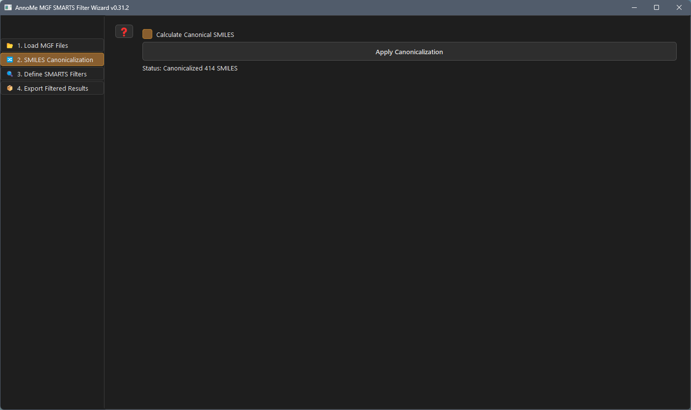

7. Next, activate the third step by clicking the respective tab on the left side of the window. This will allow filtering all loaded MS/MS spectra by substructure matches using SMARTS strings. The necessary filters can be loaded with the button `Load Filters from JSON`. Select the file `demo/GUI_PrenylatedCompounds_SMARTSFilterStrings.json` from the AnnoMe main folder. Loading and applying all filters will take some time (approximately 1 hour on a standard laptop). After the filters have been loaded successfully, the table will show the number of matches and mismatches for each filter. 

Alternatively, new filters can be specified by the user. Each filter must have a `Filter name` and a `SMARTS string`. For the latter the user can use a simple boolean logic to test for the presence of different substructures at the same time. This logic only supports OR and AND, and must be in this form `<<SMARTS_1 OR SMARTS_2>> AND SMARTS_3`.

Note: Depending on the number of filters to check and unique SMILES codes, this might take a couple of hours.

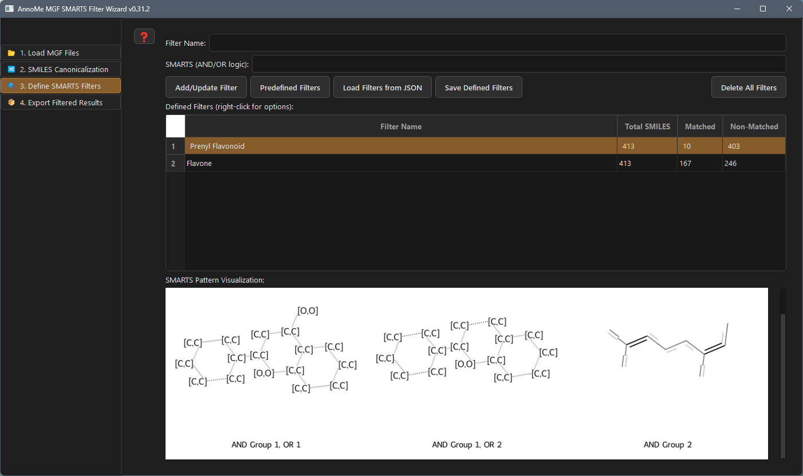

After the filters have been specified and added (with the button `Add/Update Filter`), the user can right-click on the respective filter and select `` to view the matching and non-matching structures. 

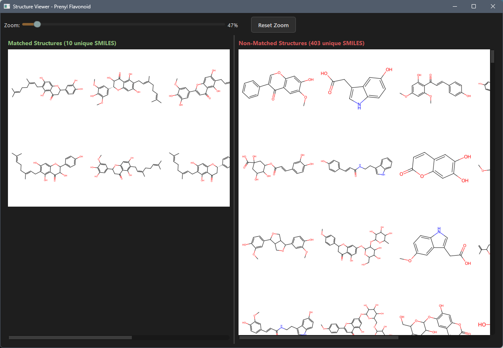

9. Then, activate the fourth and final step to export the matching and mismatching spectra to new MGF files. Click the button `Browse` and specify the new file-name `filtered` in the folder `resources/libraries_filtered_gui`. Close the new file dialog and click the button `Export Filtered MGF Files` to start the process. After a couple of minutes several files will have been generated. If there are MSMS spectra for a particular filter, it will be exported and named `filtered_<filter-name>_matched.mgf`. Furthermore, a summary mgf file with all MSMS spectra matching at least one filter will also be generated, as well as a file with all MSMS spectra matching none of the provided filters. 

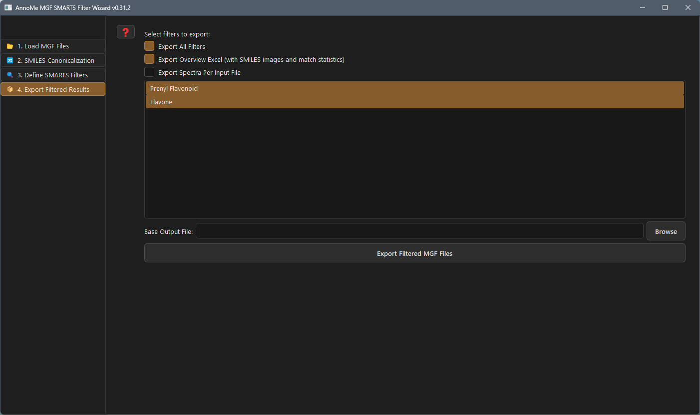

10. Close the filtering GUI. 

<br><br>

## Classification task

11. Start the classification filtering GUI with the command
```{bash}
uv run annome_classificationgui
```
This will show the window for loading the MGF files, assign them to the class `relevant` or `other` to be used for `training`, `testing`, or `inference`. 

12. Next, load the mgf files. Click the button `Import configuration` and select the file `demo/gui_PrenylatedCompounds_ClassificationFiles.json`. 

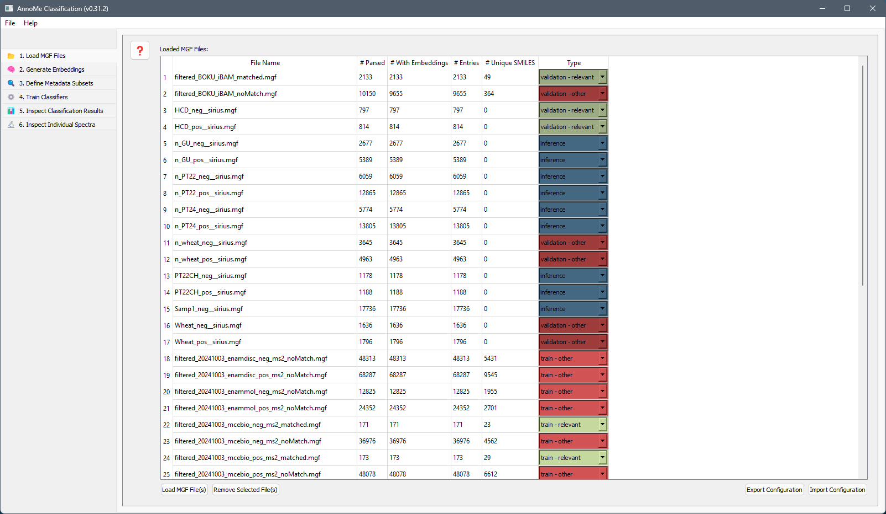

13. After loading has finished, goto the second step of the classification via a click on the tab `2. Generate Embeddings`. Then click the button `Generate Embeddings` to load the mgf files and calculate the MS2DeepScore embeddings. 

Note: Depending on the number of MS/MS spectra loaded, this step can take a significant amount of time (several hours), but results are cached after the first run. 

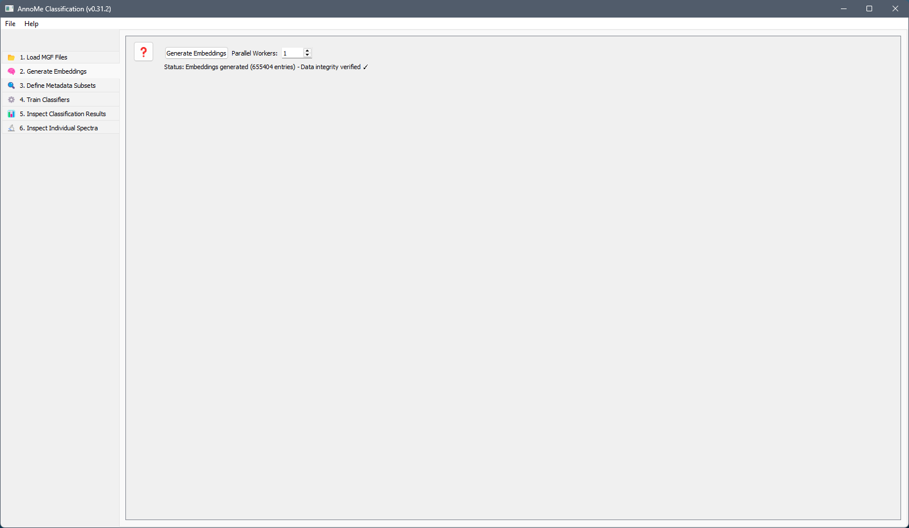

14. The next step is to define different subsets. To do this, click the third tab, and then the button `Refresh Metadata Overview`. This will populate the table undearneath showing the available meta-data keys for defining the subset filters. All keys present for a particular meta-data field can be shown in the list on the right to the meta-data table. Clicking the meta-data name directly, will show the unique keys among all loaded MGF files, while clicking a singe file will show the number of times a key was present only in this file. 

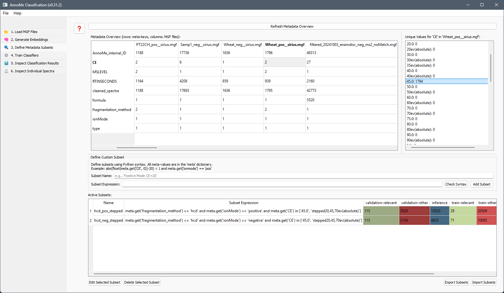

15. In the section `Define Custom Subset`, set a filter name, and define a python lambda function that filters spectra based on its meta-data information. Clicking an entry in the table will show the unique keys in the particular file for the selected meta-data field as well as the number of spectra having the respective value. To load pre-existing filters for the demo, click the button `Import Subsets` and select the file `demo/GUI_PrenylatedCompounds_ClassificationSubsets.json`. This will load and apply a total of 8 filters, for the positive and negative modes, for the fragmentation method (currently always hcd), and the fragmentation energy (20; 40; 70; and stepped collision energy). Once loaded, the table will show the number of MS/MS spectra matching the filter for the different categories. Note: loading and filtering can take some minutes. 

15. Click on the fourth tab. This allows to define different classification models to be used. Each meta-data subset from the previous step will be used for each model in this step, making a total of n x m (n.. number of subsets, m.. number of classifiers to train) training and predicting instances. A default set of classifiers and their code for initialization can be loaded via the button `Load Default`. It will containt the default filter, a more complex filter that is deactivated, and code to compare different classifiers. 

Alternatively, use the button `Load Configuration` to load a predefined set of classifiers from the file `demo/GUI_PrenylatedCompounds_ClassificationModels.json`. Then click the button `Train and Classify` to start the training and prediction process. 

Note: Depending on the number of MS/MS spectra to process, the number of meta-data subsets, and classifiers to test/compare, this might take a couple hours.

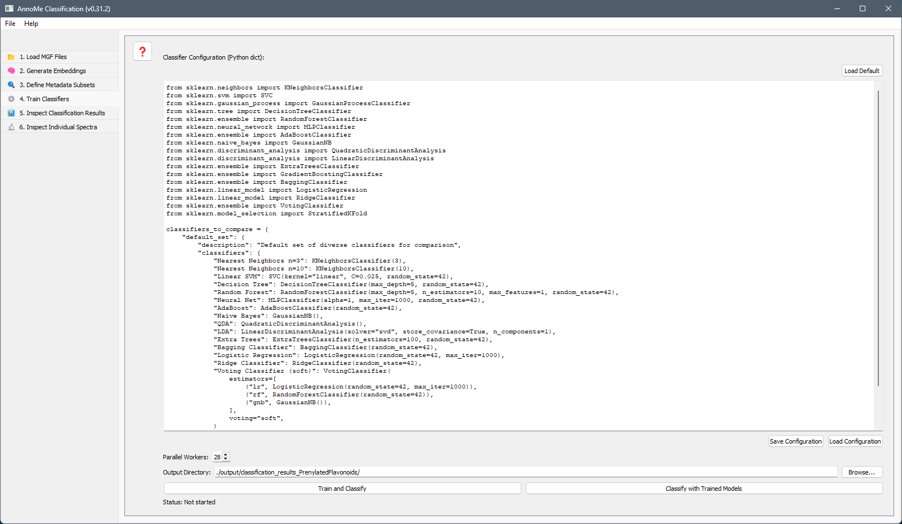

16. Next, the true/false positive/negative rates can be inspected. For this click the tab of the fifth step on the left side of the classification window. A table will show these results, aggregated by meta-data subset, classification configuration, input-file, and type class. Furthermore, results of individual metabolic features can be inspected in the sixth tab. 

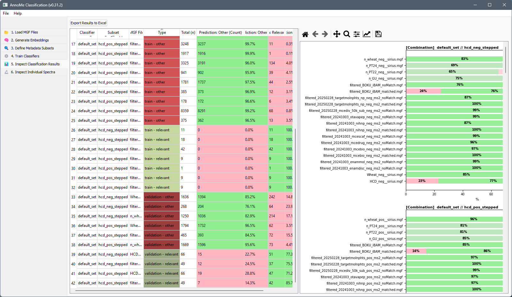

17. All results of the classification and prediction tasks are also exported to mgf and table files to be found in the folder specified in step 2. Furthermore, the prediction results can also be visualized in `step 6` of the software. Clicking a specific feature will show its meta-information, the classification result as well as its MS/MS spectrum. 

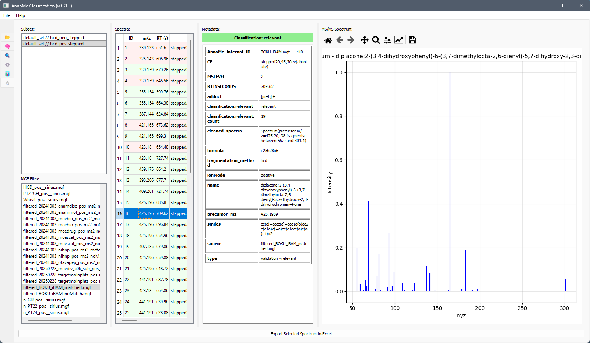

